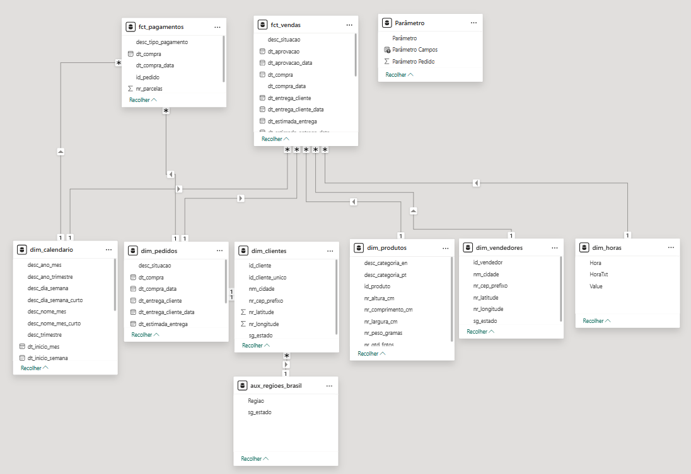

# 🛒 Brazilian E-Commerce Data Engineering Project (Olist)

Este projeto apresenta uma solução completa de Engenharia de Dados (End-to-End) utilizando a arquitetura **Medallion (Bronze, Silver, Gold)** no Databricks. O objetivo é transformar dados brutos de e-commerce em insights de negócio, enriquecidos com Inteligência Artificial Generativa.

---

## 🏗️ Arquitetura da Solução

O pipeline de dados foi construído seguindo as melhores práticas de Lakehouse, garantindo governança, qualidade e performance.

1.  **Camada Bronze:** Ingestão de dados brutos (`.csv`) para formato Delta Lake, preservando o histórico original.
2.  **Data Quality:** Perfilamento de dados com `Sweetviz` para identificação de anomalias.
3.  **Camada Silver:** Limpeza, padronização, tradução e tipagem dos dados.
4.  **Enriquecimento com IA:** Análise de sentimento de avaliações usando LLMs (Google Gemini).
5.  **Camada Gold:** Modelagem dimensional (Galaxy Schema) para consumo em Power BI.

---

## 🛠️ Tech Stack

* **Cloud & Compute:** Azure Databricks (Spark).
* **Storage & Format:** Delta Lake (Unity Catalog).
* **Language:** Python (PySpark) e SQL.
* **Generative AI:** Google Gemini API (Models: 1.5 Flash / 2.0 Flash Lite).
* **Data Quality:** Sweetviz.
* **Orchestration:** Databricks Notebooks (Modularizados).
* **Visualization:** Microsoft Power BI.

---

## 🚀 Detalhamento das Etapas

### 1. Ingestão e Armazenamento (Bronze)
Carregamento dos 9 datasets públicos da Olist para o Data Lake.
* **Ação:** Conversão de arquivos CSV para Tabelas Delta gerenciadas.
* **Resultado:** Dados brutos preservados com schema inferido.

### 2. Tratamento e Padronização (Silver)
Transformação dos dados brutos em dados confiáveis para negócio.
* **Padronização:** Renomeação de colunas (Inglês -> Português) e convenção `snake_case`.
* **Tipagem:** Conversão explícita de colunas de data (`string` -> `timestamp`) e monetárias (`double`).
* **Sanitização:**
    * Remoção de acentos e padronização de cidades (ex: "são paulo" -> "sao paulo").
    * Limpeza de caracteres especiais em textos de avaliações.

### 3. Enriquecimento com IA Generativa (Feature Engineering)
Utilização de LLMs para analisar comentários de clientes na tabela `order_reviews`.
* **Modelo:** Google Gemini (via API).
* **Tarefa:** Classificar o sentimento do comentário em: *Positivo, Negativo ou Neutro*.
* **Nota de Arquitetura (Fallback):** Devido às limitações de cota (Rate Limit) da API gratuita do Google, foi processada uma amostra estatística dos dados. Para o restante do dataset, foi implementado um algoritmo de *fallback* baseado em regras (palavras-chave) para garantir a integridade do pipeline sem violar SLAs de processamento.

---

## 4. Análise de Qualidade de Dados (Insights)

Utilizando a biblioteca **Sweetviz**, foram gerados relatórios de perfilamento (profiling) sobre a camada Bronze. Abaixo, destacam-se 3 achados principais que guiarão o tratamento na camada Silver:

### 🚨 Insight 1: Inconsistência de Grafia em Cidades
**Tabela:** `customers`
**Diagnóstico:** Identificada duplicidade de registros para a mesma cidade devido a variações de acentuação e grafia.
- **Evidência:** O relatório aponta alta cardinalidade na coluna `customer_city`, com variações como `sao paulo` e `são paulo` para a mesma localidade.
- **Ação na Silver:** Aplicação de funções de normalização (Lower, Trim e remoção de acentos) para garantir a integridade dos agrupamentos geográficos.

### 🚨 Insight 2: Baixa Completude em Dados Desestruturados
**Tabela:** `order_reviews`
**Diagnóstico:** As colunas de texto livre (`review_comment_message` e `review_comment_title`) apresentam alta taxa de valores nulos (Missing).
- **Evidência:** O perfilamento indica que mais de 58% dos registros nessas colunas estão vazios ou nulos (barras vermelhas no relatório).
- **Ação na Silver:** Tratamento de nulos com preenchimento padrão ("Não Informado") para evitar erros em modelos de NLP, além da sanitização de caracteres especiais (quebras de linha).

### 🚨 Insight 3: Registros Logísticos Incompletos (Nulls)
**Tabela:** `orders`
**Diagnóstico:** Campos cruciais para cálculo de frete e SLA, como `order_delivered_customer_date`, possuem valores nulos.
- **Evidência:** O relatório aponta *Missing Values* nas datas de entrega, correspondentes a pedidos com status `invoiced`, `processing` ou `canceled`.
- **Ação na Silver/Gold:** Filtragem de status ou tratamento condicional ao calcular métricas de "Tempo de Entrega" (Lead Time), garantindo que apenas pedidos finalizados componham o indicador de performance.

### 📊 Evidências de Qualidade (Relatórios HTML)
Os relatórios detalhados gerados pelo Sweetviz estão disponíveis na pasta `docs`. Você pode baixá-los para visualizar a análise completa:

* [Relatório de Clientes (Customers)](./docs/report_customers.html)
* [Relatório de Pedidos (Orders)](./docs/report_orders.html)
* [Relatório de Avaliações (Reviews)](./docs/report_order_reviews.html)
* [Acessar pasta completa](./docs)

*Nota: Como o GitHub não renderiza arquivos HTML nativamente, é necessário clicar no arquivo desejado e selecionar a opção "Download raw file" para visualizar.*

---

## 5. Modelagem Dimensional (Camada Gold)

Para viabilizar a análise no Power BI, os dados foram reestruturados em um **Galaxy Schema** (Constelação), permitindo o cruzamento de fatos com granularidades distintas.

### Dimensões (`dim_`)
* **`dim_calendario`:** Gerada via código PySpark (2016-2020), replicando lógica DAX para suporte a Time Intelligence em Português.
* **`dim_clientes`:** Enriquecida com Latitude/Longitude média (agrupada por CEP) para permitir mapas de calor (Heatmaps).
* **`dim_vendedores`:** Enriquecida com Latitude/Longitude.
* **`dim_produtos`:** Enriquecida com a tradução das categorias (Português -> Inglês).
* **`dim_pedidos` (Bridge Table):** Tabela de ponte contendo o cabeçalho do pedido. Resolve a cardinalidade N:N entre Vendas e Pagamentos, atuando como o elemento centralizador do modelo.

### Fatos (`fct_`)
* **`fct_vendas`:** Granularidade no **Item do Pedido**. Contém métricas de receita, frete, prazos de entrega (Lead Time) e o sentimento da IA.
* **`fct_pagamentos`:** Granularidade no **Pagamento**. Separada para evitar a duplicação de receita (Fan Trap) em pedidos com múltiplos meios de pagamento.



---

## 6. Query de Validação de Negócio (Item 7 do Case)

Para validar a eficácia do enriquecimento com IA, foi executada uma query analítica na camada Gold cruzando a **Nota do Cliente** (Dado Estruturado) com o **Sentimento da IA** (Dado Desestruturado).

```sql
-- Query de Validação do Enriquecimento com IA (Camada Gold)
SELECT 
    p.desc_categoria_pt AS Categoria,
    v.id_pedido,
    v.nr_nota_review AS Nota_Cliente,
    v.sentimento_ia AS Classificacao_IA,
    v.vl_total_item AS Valor_Venda
FROM workspace_ecommerce.gold.fct_vendas v
INNER JOIN workspace_ecommerce.gold.dim_produtos p ON v.id_produto = p.id_produto
WHERE v.sentimento_ia IS NOT NULL 
  AND v.sentimento_ia <> 'Não Analisado' 
ORDER BY v.nr_nota_review ASC 
LIMIT 15;
